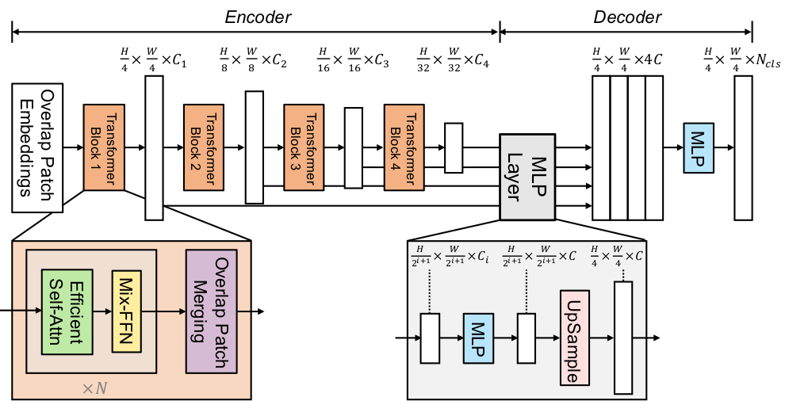
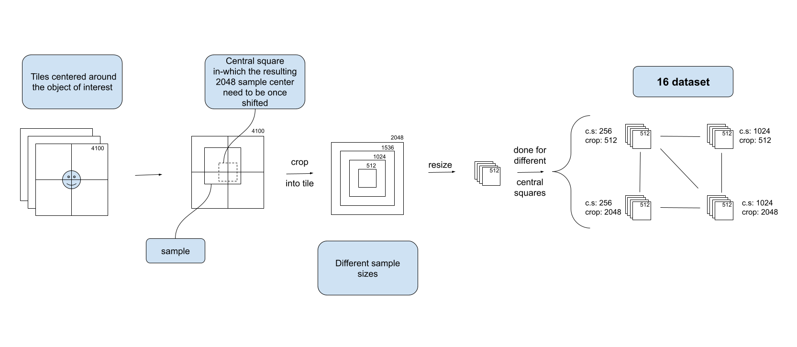

# TODO BEFORE THE END
- change path to repo when migrated to terranum


# Playground segmentation

## How to install
to install this pipeline, you need to have CUDA installed on your machine and follow these steps:
1) Clone the repo on local\
  Open a terminal, cd your way to the desired location and type:
    ```
    git clone --depth=1 https://github.com/destoswa/playground_segmentation
    ```
  
2) Create a virtual environment
    ```
    cd playground_segmentation
    python -m venv .venv
    ```
3) Activate environment
    ```
  .venv\Script\activate
    ```
4) Install the libaries
    ```
    pip install -r requirements.txt
    ```

## Introduction
This repo contains a pipeline made to practice binary semantic segmentation. The pretrained model has been finetuned to discriminate playgrounds from background in aerial images with original resolution of 10cm/pixel.

However, those images were alternated to obtaine version with greater context and lower resolution (resolution lowered down to a factor 0.25), allowing the model to be more versatile.

This versatility allows then, in the Inference phase (production.py), to assess the samples under multiple resolutions. By doing that and regrouping the different predictions together, it allows the pipeline to ally the advantages of lower resolution and higher context while keeping the samples at a resonable size (a NVIDIA LAPTOP RTX3060 is enough to make production).

## Model
The model used is called SegFormer. It is available on Huggingface database (see links in acknowledgements).

It's particularity is the use of Mix Transformer which allow the use of both self-attention and cnn into a computational power efficient architecture.



The different available pretrained model of Huggingface are listed [here](https://huggingface.co/models?other=segformer) .
## Production (Inference)
A pretrained model is already present in the repo under `model/segmenter_playground`.
In order to make predictions on new tiles, open the file `production.yaml` and precise the following:
if you already have the tiles, set their location into `data\source`.
if you want to download them on swisstopo, use the `downloader` section (`skip_auto_sownloading` -> False). the tiles will be saved in `data\source`.
A few important parameters:
- `predictions\model_dir`: Here the default one is the model comming with the repo. If you finetuned it into a new version, precise the path to the new one (not the checkpoint, but the parent of the different checkpoint. it will automatically gofind the best version)
- `predictions\batch_size`: The initial value is the one used with 6Go of VRAM. Adapat it accordingly to if you have more or less VRAM.
- `predictions\threshold_preds`: This parameter is very important. A higer value (e.g. 0.5) will lead to less but more precise predictions (less false positives but more false negatives) and a lower value (e.g. 0.25) will lead to the opposite.
- `to_keep\*`: Choose here which results you want to keep, additionaly to the final product (geopackage).

## Training
The training of a model is done via the script `training.py` and is driven by the configuration file `config/training.yaml`.
It is possible to train a new model:
- from one of the pretrained model of NVIDIA
- from a pretrained model of this project
- from an interrupted training 

### Preprocessing
The preprocessing is a tool that help to prepare a dataset from a set of tiles of bigger size (e.g. 4100px) centered on the object of interest, to cropped version (e.g. 512px) of different scales. It is run through the script `preprocessing.yaml`, drive by teh configuration file `config\preprocessing.yaml`

As explained in the figure, 16 versions of the dataset (more precisaly, it is producing $N_{central squares} \cdot N_{scales}$ datasets) are produced. The idea is then for the user to choose, for each scale, the version with the central square which offers the best ratio of empty/occupied samples. This ratio can be seen for each configuration in the generated figure `fraction_of_occupied.png` in the resulting folder.



### Finetuning
With the use of the model and the correction by human eye, new data should start to be produce. Moreover, some patterns of false positives might start to be visible with corrections. From these samples can be extracted a dataset to finetune the model.

In order to generate this dataset, a tutorial (the file `tuto_finetuning.md`) is available at the root of the project. It will help the user to create the tiles and then use the preprocessing script.

## Acknowledgements
This project was done by using both the [Transformers](https://huggingface.co/docs/transformers/index) library and the 
[SegFormer](https://huggingface.co/docs/transformers/model_doc/segformer) model of Huggingface.

